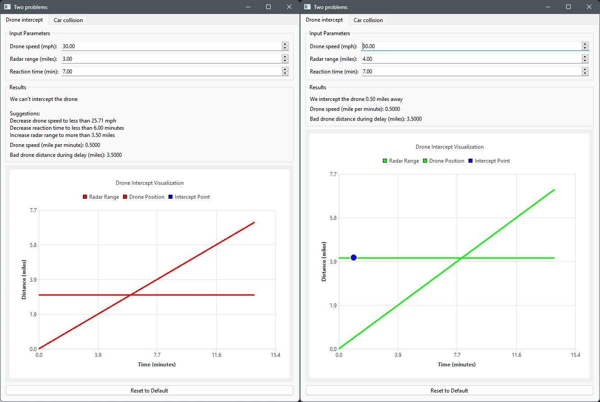
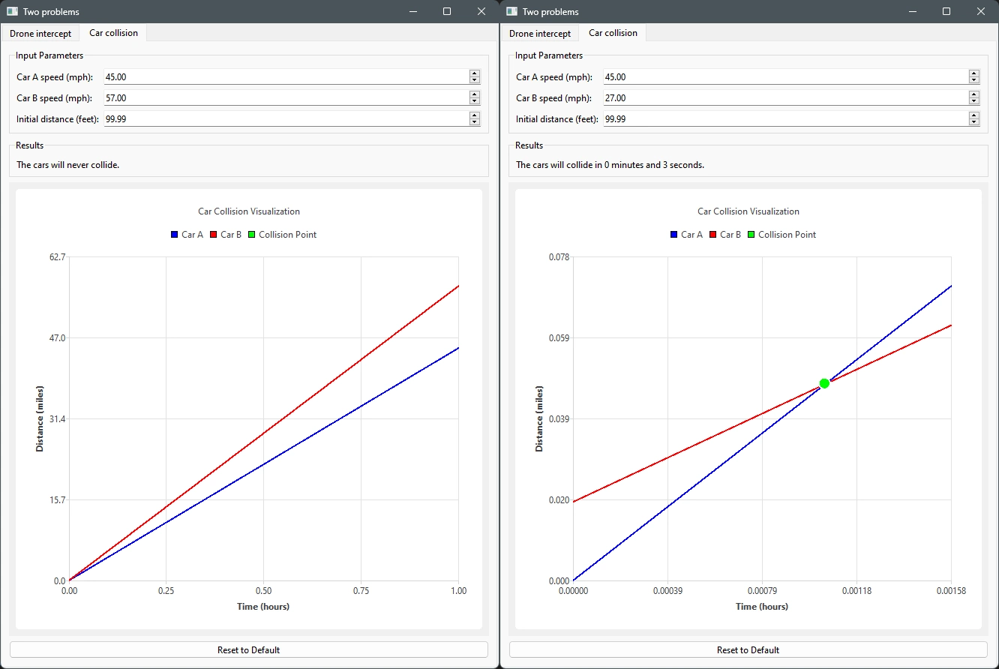

# Vehicle Interception Calculator

This is an interactive Python application for simulating a drone interception problem and a car collision problem. PySide6 is used to create the GUI with dynamic visualizations.

## Table of Contents

- [Features](#features)
- [Installation](#installation)
- [Usage](#usage)
- [License](#license)

## Background

I was haunted by these two problems after my brain short circuited while solving them on paper for an interview, and I haven't created anything with Qt in a while, so I made this for some practice.

## Features

### Drone Intercept

- Parameters: drone speed, radar range, and reaction time
- Calculates interception possibilities for drones
- Gives suggestions for successful interception when not possible

### Car Collision

- Parameters: speeds of both cars and initial distance between them
- Calculates time until collision for two cars

## Requirements
- Python 3.x
- PySide6

## Installation

1. Clone this repository
2. Install dependencies: `pip install PySide6`

## Usage

1. Run the application:
    `python main.py`
2. Use the tabs to switch between simulations. 
3. Adjust parameters using the spinboxes.

## License

[MIT License](LICENSE)